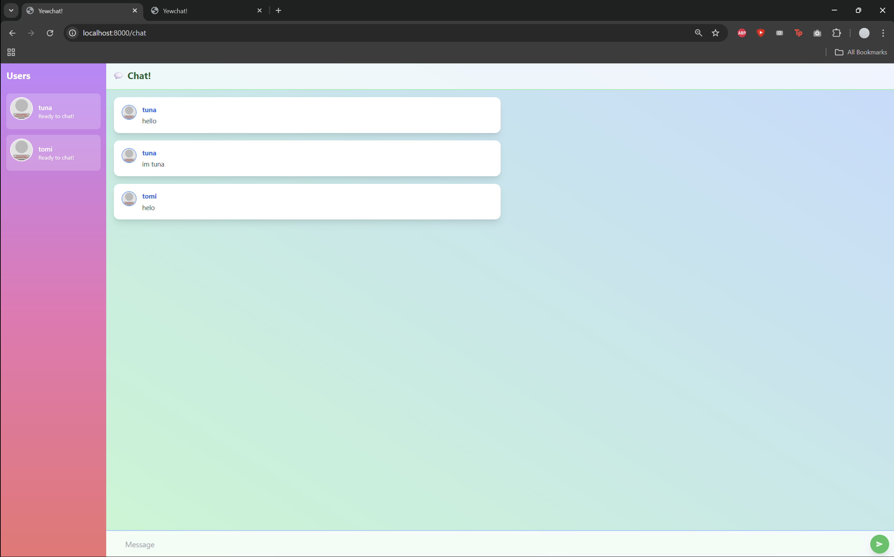

# YewChat 💬

> Source code for [Let’s Build a Websocket Chat Project With Rust and Yew 0.19 🦀](https://fsjohnny.medium.com/lets-build-a-websockets-project-with-rust-and-yew-0-19-60720367399f)

## Install

1. Install the required toolchain dependencies:
   ```npm i```

2. Follow the YewChat post!

## Branches

This repository is divided to branches that correspond to the blog post sections:

* main - The starter code.
* routing - The code at the end of the Routing section.
* components-part1 - The code at the end of the Components-Phase 1 section.
* websockets - The code at the end of the Hello Websockets! section.
* components-part2 - The code at the end of the Components-Phase 2 section.
* websockets-part2 - The code at the end of the WebSockets-Phase 2 section.


# Original code


# Be Creative!


The chat view is laid out as a horizontal flex container with a vibrant gradient sidebar showing each user in a semi-transparent card with a rounded avatar and hover effect. The main area features a translucent header titled “Chat!” above a scrollable list of white, rounded message cards that include a blue-bordered avatar, bold blue sender name, and gray text with gif links rendered as images. A translucent footer holds a rounded green input field with a focus ring and a circular green send button adorned with a paper-plane icon that darkens on hover.